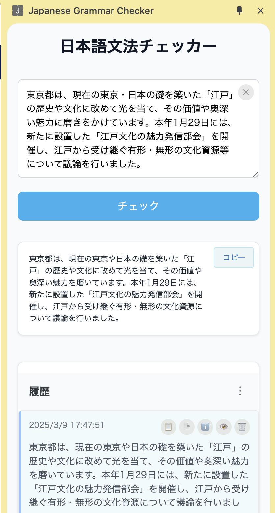

# Japanese Grammar Checker Chrome Extension

AI-powered Japanese grammar checker and optimizer Chrome extension.

## Installation

### Option 1: Install from ZIP file (Recommended)

1. Download the latest release ZIP file from the [Releases page](https://github.com/macshion/japanese-grammar-checker/releases)
2. Extract the ZIP file to a folder on your computer
3. Open Chrome and navigate to `chrome://extensions/`
4. Enable "Developer mode" (toggle in the top-right corner)
5. Click "Load unpacked" and select the extracted folder
6. The extension should now be installed and ready to use

### Option 2: Build from source

1. Clone the repository
2. Install dependencies: `npm install`
3. Build the extension: `npm run clean:build`
4. Load the `dist` directory in Chrome as an unpacked extension

## Project Structure

```
japanese-grammar-checker/
├── config.js                # Root configuration file
├── manifest.json            # Chrome extension manifest
├── icon.svg                 # Extension icon
├── sidebar.html             # Sidebar HTML
├── vite.config.js           # Vite configuration for development
├── vite.config.extension.js # Vite configuration for extension build
├── package.json             # NPM package configuration
├── src/                     # Source code directory
│   ├── js/                  # JavaScript files
│   │   ├── background.js    # Extension background script
│   │   ├── content.js       # Content script
│   │   ├── config.js        # Application configuration
│   │   └── sidebar.js       # Sidebar functionality
│   └── css/                 # CSS files
│       └── sidebar.css      # Sidebar styles
└── dist/                    # Build output directory
```

## Development

### Prerequisites

- Node.js (v14 or later)
- npm (v6 or later)

### Setup

1. Clone the repository
2. Install dependencies:

```bash
npm install
```

### Development Commands

- Start development server:

```bash
npm run dev
```

- Build for production:

```bash
npm run build
```

- Build Chrome extension:

```bash
npm run build:extension
```

- Clean build directory and rebuild extension:

```bash
npm run clean:build
```

## Loading the Extension in Chrome

1. Build the extension:

```bash
npm run clean:build
```

2. Open Chrome and navigate to `chrome://extensions/`
3. Enable "Developer mode" (toggle in the top-right corner)
4. Click "Load unpacked" and select the `dist` directory
5. The extension should now be installed and ready to use

## Usage

1. Click on the extension icon in the Chrome toolbar
2. The sidebar will open with the Japanese Grammar Checker
3. Enter Japanese text in the input area
4. Click "チェック" to check the grammar
5. View the corrected text in the result area
6. Use the copy button to copy the corrected text
7. View and manage your history in the history section

## Configuration

You can modify the extension's configuration in the following files:

- `config.js`: Root configuration file
- `src/js/config.js`: Application-specific configuration
- `manifest.json`: Chrome extension configuration

## Milestone

### 2025.03.09 V1.0.0




### 2025.04.04 V2.0.0

- Add UT Framework

## 日本語文法チェッカー (Japanese Grammar Checker)

日本語の文法チェック、翻訳、および AI チャット機能を提供するウェブアプリケーションです。

### 機能

- **文法チェック**: 日本語の文章を入力して、文法的な間違いを修正します。より自然で適切な表現に改善します。
- **翻訳**: 日本語から他の言語への翻訳、または他の言語から日本語への翻訳を行います。
- **AI チャット**: 日本語学習に関する質問や、一般的な日本語の使い方について質問できます。

### 開発

#### 依存関係のインストール

```bash
npm install
```

#### 開発サーバーの起動

```bash
npm run dev
```

#### ビルド

```bash
npm run build
```

#### テスト

テストを実行するには：

```bash
npm test
```

特定のテストファイルのみを実行するには：

```bash
npm test -- tests/utils/api.test.js
```

ウォッチモードでテストを実行するには：

```bash
npm run test:watch
```

カバレッジレポートを生成するには：

```bash
npm run test:coverage
```

### 構成

このアプリケーションは以下のモジュールで構成されています：

- **文法チェック**: 日本語の文法と表現を検証し改善します。
- **翻訳**: 複数の言語間で翻訳を行います。
- **AI チャット**: 日本語に関する様々な質問に回答します。
- **履歴管理**: 全ての操作履歴を保存、表示、フィルタリングします。

### ライセンス

MIT
